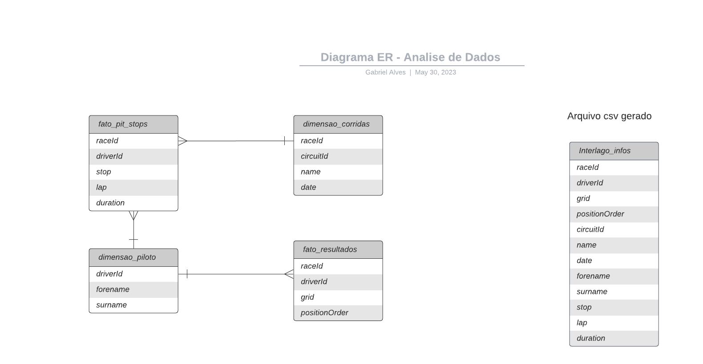

# ANÁLISE DE DADOS - corridas de formula 1 desde 1950 até 2023.

<h1>Pergunta/Tema do projeto:</h1>
<h2>"Qual a relação em fazer pit-stops abaixo da média da corrida e a sua colocação final"?<h2>

## Filtrado por um só circuito, sendo o escolhido para o projeto o circuito de [Interlagos](https://pt.wikipedia.org/wiki/Aut%C3%B3dromo_de_Interlagos).

</br>

## Fonte - https://www.kaggle.com/datasets/rohanrao/formula-1-world-championship-1950-2020.

## Diagrama ER



### O arquivo [Initial_ETL.ipynb](https://github.com/SouzaGabriel26/projeto-integrador3/blob/main/Initial_ETL.ipynb) é o arquivo inicial, onde são feitas leituras e transformações nos DataFrames para salvá-los no banco. Posteriormente, os dados são recuperados do banco e unidos em um só DataFrame através de uma query. Após este processo, é gerado um arquivo excel [Interlago_infos.csv](https://github.com/SouzaGabriel26/projeto-integrador3/blob/main/Interlago_infos.csv) sobre esses dados obtidos pela query, para trabalharmos sem a necessidade da conexão com o banco.

</br>


### A query utilizada foi:
```sql
SELECT *
FROM dimensao_corridas c
INNER JOIN fato_pit_stops ps ON ps."raceId" = c."raceId"
INNER JOIN dimensao_pilotos dp ON dp."driverId" = ps."driverId"
INNER JOIN fato_resultados r ON r."driverId" = dp."driverId"
WHERE c."circuitId" = 18
```

</br>

### A partir de agora, para realizar a Análise exploratória e a previsão, usaremos o arquivo Interlago_infos.csv, que foi gerado pela query acima.

</br>

- [✔] Primeira entrega - ETL para geração de tabelas Fato e Dimensão, Documentação, Diagrama ER e Dicionário de Dados.
- [✔] Segunda entrega - Análise exploratória dos Dados Obtidos na ETL.
- [ ] Terceira entrega -
