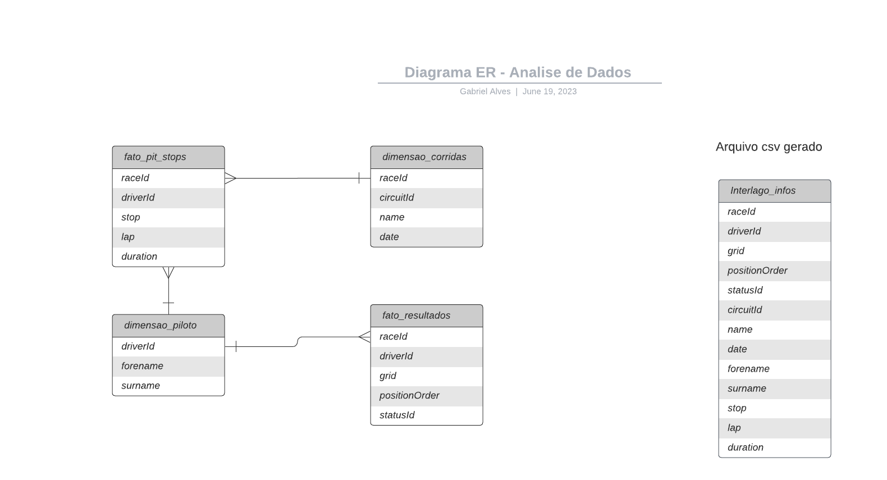

# ANÁLISE DE DADOS - corridas de formula 1 desde 1950 até 2023.

<h1>Pergunta/Tema do projeto:</h1>
<h2>"Em qual posição final um piloto ficará ao final da corrida, com base em dados numéricos/categóricos?"<h2>

## OBS: Filtrado por um só circuito, sendo o escolhido para o projeto o circuito de [Interlagos](https://pt.wikipedia.org/wiki/Aut%C3%B3dromo_de_Interlagos).

</br>

## Fonte - https://www.kaggle.com/datasets/rohanrao/formula-1-world-championship-1950-2020.

### Os datasets utilizados para este trabalho estão disponíveis em [datasets](https://github.com/SouzaGabriel26/projeto-integrador3/tree/main/datasets).

## Diagrama ER



### O arquivo [Initial_ETL.ipynb](https://github.com/SouzaGabriel26/projeto-integrador3/blob/main/Initial_ETL.ipynb) é o arquivo inicial, onde são feitas leituras e transformações nos DataFrames para salvá-los no banco. Posteriormente, os dados são recuperados do banco e unidos em um só DataFrame através de uma query. Após este processo, é gerado um arquivo excel [Interlago_infos.csv](https://github.com/SouzaGabriel26/projeto-integrador3/blob/main/Interlagos_infos.csv) sobre esses dados obtidos pela query, para trabalharmos sem a necessidade da conexão com o banco.

</br>

### A query utilizada foi:
```sql
SELECT *
FROM fato_resultados
INNER JOIN dimensao_corridas ON fato_resultados."raceId" = dimensao_corridas."raceId"
INNER JOIN dimensao_pilotos ON dimensao_pilotos."driverId" = fato_resultados."driverId"
INNER JOIN fato_pit_stops ON fato_resultados."raceId" = fato_pit_stops."raceId" AND fato_resultados."driverId" = fato_pit_stops."driverId"
WHERE dimensao_corridas."circuitId" = 18
```

</br>

### A partir de agora, para realizar a Análise exploratória e a previsão, usaremos o arquivo [Interlago_infos.csv](https://github.com/SouzaGabriel26/projeto-integrador3/blob/main/Interlagos_infos.csv), que foi gerado pela query acima.

### O arquivo onde está a análise e previsão é o [mainScript.ipynb](https://github.com/SouzaGabriel26/projeto-integrador3/blob/main/mainScript.ipynb).

</br>

- [✔] Primeira entrega - ETL para geração de tabelas Fato e Dimensão, Documentação, Diagrama ER e Dicionário de Dados.
- [✔] Segunda entrega - Análise exploratória dos Dados Obtidos na ETL.
- [ ] Terceira entrega -
